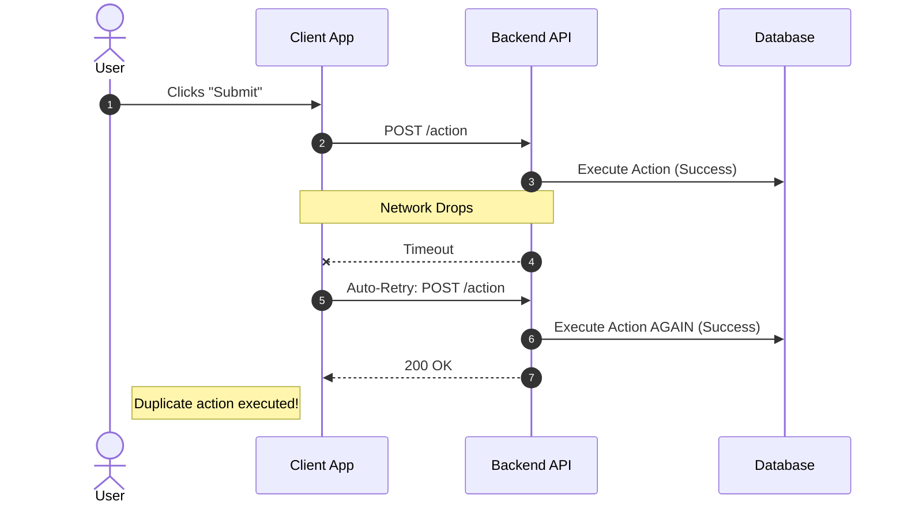

So, if you've worked with distributed systems, you already know networks are pretty unreliable. Requests drops, databases hang up, and sometimes packets just vanish into the void. To fix this, we usually build systems that automatically retry failed API calls. But retries brings a dangerous new problem: what if the original request actually succeeded, but the success response was just lost in transit?

If you are building an e-commerce backend or a payment gateway, an unhandled retry can mean charging your customer twice. Which is obviously bad. This is where the concept of **Idempotency** comes in to save the day.

## What is Idempotency anyway?

At its core, it's a math concept. An operation is idempotent if applying it multiple times gives you the exact same result as applying it just once.

In math it's basically $f(f(x)) = f(x)$.

In software engineering, an idempotent API endpoint guarantees that no matter how many times a client send the *exact same request*, the system state will only change once. The side effects (like deducting money from a wallet) happen on the first request. Any identical requests after that just returns the success response of that first try without running the core logic again.

## The Role of HTTP Verbs

Not all API calls needs complex idempotency logic. In REST APIs, the HTTP verbs themselves kind of dictate what should happen:

* **GET (Idempotent & Safe):** Fetching data. Whether you call `GET /users/123` once or a thousand times, the database doesn't change.
* **PUT (Idempotent):** Updating a resource. If you send `PUT /users/123 {name: "Alice"}`, the first call updates it. The next 99 calls just overwrites "Alice" with "Alice". End result is the same.
* **DELETE (Idempotent):** Deleting a resource. `DELETE /users/123` removes it. Calling it again might give a `404 Not Found`, but the end state (user is gone) remains identical.
* **POST (NOT Idempotent):** Creating a resource or doing an action. If you hit `POST /charges {amount: 500}` five times, you'll create five charges and deduct $2500. **POST requests are basically where all the idempotency bugs live.**

## The Core Trigger: Retries

Here is the thing to remember: **If there is no mechanism of retry, idempotency is not an issue.** If your system just throws a 500 error and expect the user to walk away, duplicate processing won't happen. But modern apps can't afford to drop transactions on a tiny network blip. Mobile apps and microservices are configured to auto-retry on timeouts.

A timeout just means "I don't know what happened." It doesn't mean the operation failed. The server might have actually processed the charge, but the connection died before the `200 OK` reached the client. When the automated retry kicks in, a non-idempotent `POST` endpoint will just blindly process it again.

To solve this, we need an **Idempotency Key**. In [Idempotency in Payments: The Client-Generated Key Approach](/blog/idempotency-in-payments-the-client-generated-key-approach), I'll show you the most common way to build this using client-generated keys.
