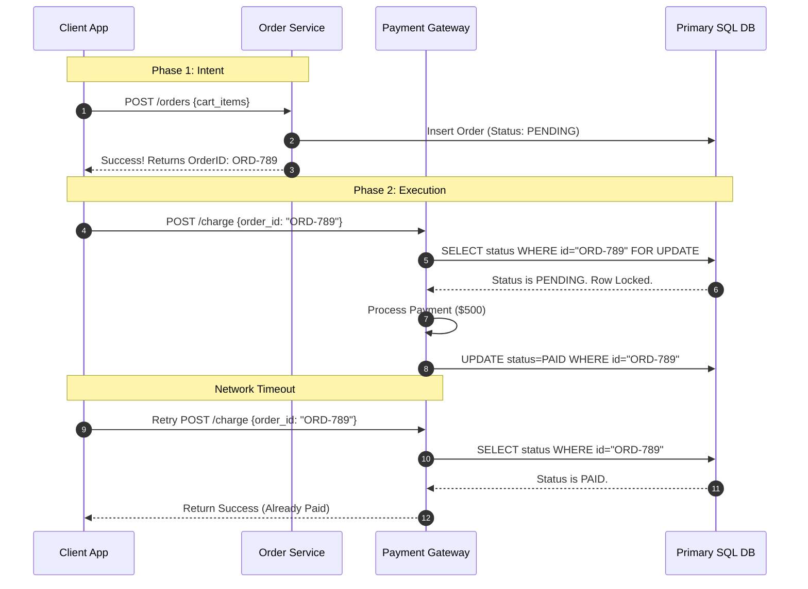

In [Idempotency in Payments: The Client-Generated Key Approach](/blog/idempotency-in-payments-the-client-generated-key-approach) we looked at using client generated UUIDs for idempotency. It works well, but it has a big flaw: you are relying entirely on the frontend to behave.

If an app crash during a payment, loses its local state, and the user tries again, the frontend will just generate a new UUID. Your backend will see this new key, think it's a fresh request, and bam—double charge. Also, hackers can just generate floods of random UUIDs to script-test stolen credit cards against your API.

If you want to build a really robust payment system (like how Stripe or Razorpay does it), you need to shift the control to the backend using a **Two-Phase Order Creation** pattern.

## The Two-Phase Flow

In this setup, the client can't just hit a `POST /charge` endpoint out of nowhere. The flow is split into two steps, and the backend generates the ID, which tightly couples the payment to a real row in your database.

### Phase 1: Intent Creation

The frontend tells the backend, "Hey, I want to create an order for these cart items." The backend does the math, creates an `Order` row in your SQL database with a status of `PENDING`, and gives back a unique `OrderID`.

### Phase 2: Execution

Now the client calls the actual payment gateway, passing that backend-generated `OrderID` instead of some random UUID. This `OrderID` *becomes* your idempotency key.

## Why This Architecture is Better

### 1. Database-Level Integrity

Look at Phase 2. We are using a row lock (`SELECT ... FOR UPDATE` in Postgres/MySQL). Because the payment is tied directly to a physical row in your primary DB, we don't even need a separate Redis cache to track keys. The order's `status` column acts as the absolute source of truth.

### 2. Payload Control

With client UUIDs we had to hash the payload to make sure they didn't change the amount on a retry. With backend keys, we don't care. The client can't change the amount because the payment gateway just fetches the expected amount directly from the database using the `OrderID`. The client is just saying "execute payment for this order," nothing else.

### 3. Crash Resilience

If the client app crashes between Phase 1 and Phase 2, the order just sits there as `PENDING` in your database. When they open the app again, it fetches pending orders, sees `ORD-789`, and resumes the payment. There's zero risk of them accidentally generating a new intent and getting charged twice.

## Wrap Up

If you are dealing with money, idempotency is non-negotiable. While `GET` and `PUT` are naturally safe, you have to protect `POST` requests from automated network retries.

Whether you go with the simple Redis Client-UUID approach, or the heavier database Two-Phase approach, putting idempotency in place ensures your system can survive the messy reality of the internet. Build for failure, and you'll sleep better when you're on call.