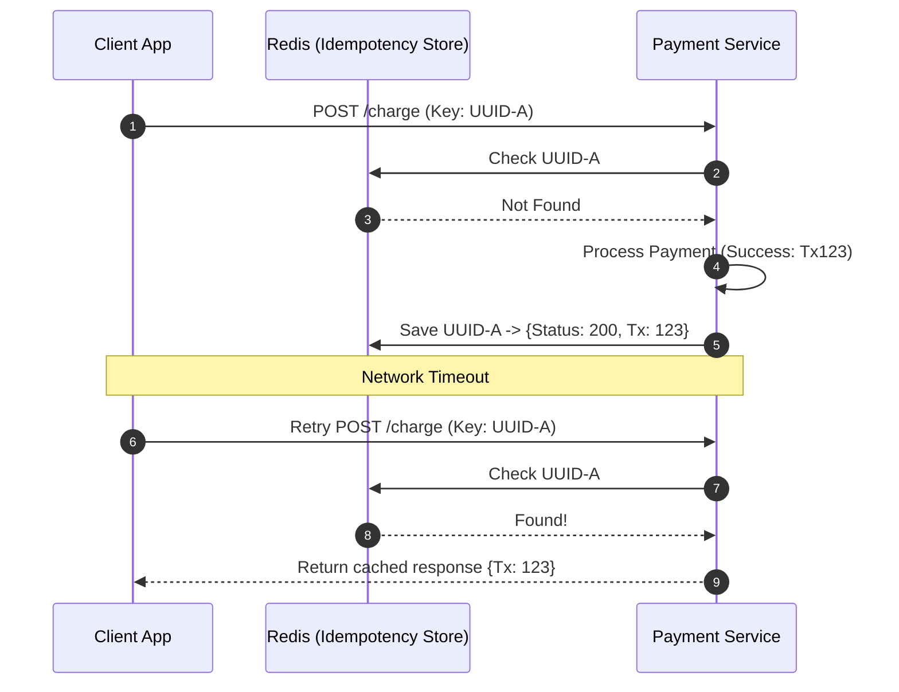

In [Demystifying Idempotency](/blog/demystifying-idempotency-the-foundation-of-reliable-distributed-systems), we saw how POST requests plus auto-retries is a recipe for disaster. If a payment API drops the connection after charging a card, your frontend retry will just charge them again.

To stop this, the backend needs a way to know that request #2 is just a retry of request #1. The industry standard way to do this is the **Client-Generated Idempotency Key**.

## How It Works

Before making a payment request, the client app (like your React frontend or Android app) generates a unique string representing the *intent* of the transaction. Usually we just use a V4 UUID.

The client passes this UUID in the HTTP headers, something like `Idempotency-Key: <uuid>`.

If the request timeout and the client retries, it **must** send the exact same payload with the exact same `Idempotency-Key`. The backend stores these keys so it can catch duplicates before it hits the actual payment logic.

## System Design: Building the Backend

Writing this securely takes more than just a quick `SELECT` query. You have to handle race conditions and bad clients.

### 1. Storage and Distributed Locks

Imagine a user double-clicks the "Pay" button and two identical requests hits your API at the exact same millisecond. If both check the database at the same time, see the key doesn't exist, they will both proceed to charge the user.

You need a really fast atomic data store. **Redis** is usually the go-to here.
You have to use a Distributed Lock. When request #1 comes in, it uses an atomic `SETNX` (Set if Not Exists) in Redis to lock `UUID-A`. If request #2 arrive a millisecond later, the lock fails, and the backend can immediately reject it with a `409 Conflict`.

### 2. Payload Hashing (Preventing bugs)

What if the client have a bug, or someone is messing with the API?

* **Attempt 1:** `POST /charge {amount: 500}` with `Key: UUID-A`. (Timeouts)
* **Attempt 2:** `POST /charge {amount: 1000}` with `Key: UUID-A`.

If your backend just blindly returns the cached success response from Attempt 1, the client will think it charged $1000, but actually only $500 went through.

**The Fix:** When you cache the idempotency key, also store a hash (like SHA-256) of the request body. On a retry, hash the new payload and compare. If the hashes don't match, throw a `400 Bad Request` because the client is reusing keys incorrectly.

### 3. Time To Live (TTL)

You don't need to keep these keys in your database forever. They only need to outlive the client's retry window. Setting a 24-hour TTL on your Redis cache is usually fine. After 24 hours, sending that same key acts like a brand new request.

## Limitations

This approach is great and easy to build, but it has one flaw: you are putting a lot of trust in the client. If a mobile app crashes mid-transaction, loses its local memory, and the user tries again... the app generates a *new* UUID. Your backend sees a new key and processes it again. Double charge!

To make it truly bulletproof, we need to take key generation away from the client. I'll cover this Two-Phase approach in [Idempotency in Payments: The Backend-Generated Key Approach](/blog/idempotency-in-payments-the-backend-generated-key-approach).